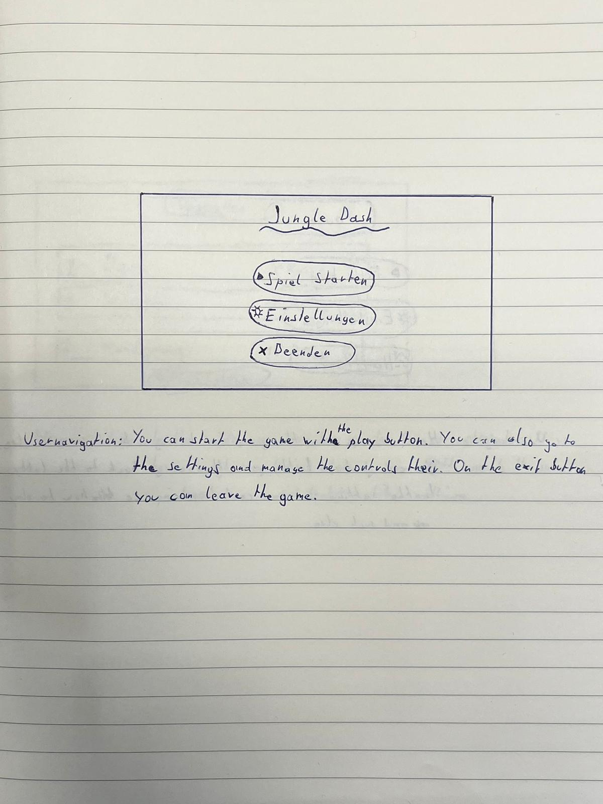
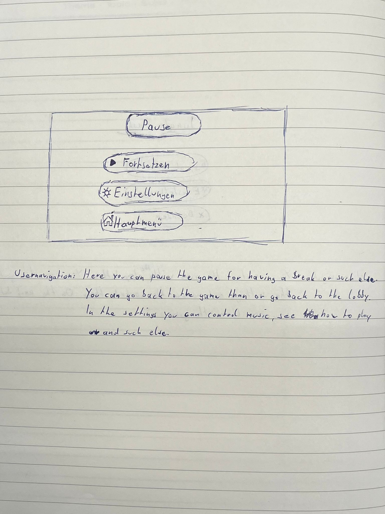
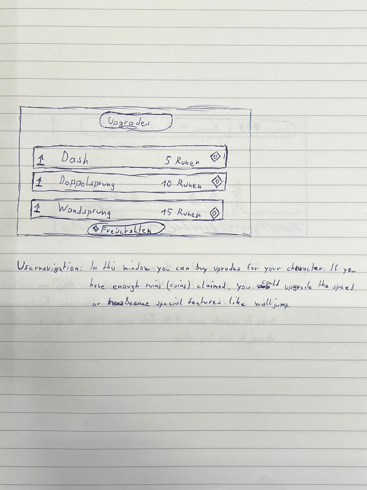
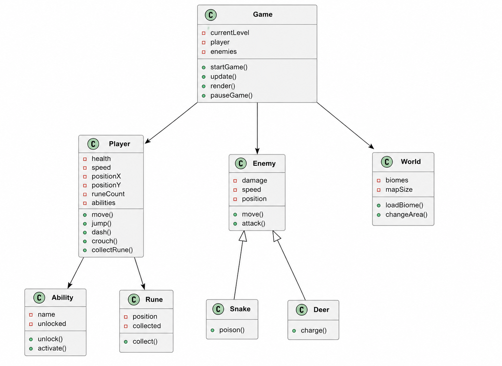

# Grober Entwicklungsplan
### ***Game Engine:*** Godot

## GUI - Skizzen
### 1. Hauptmenü - Window
Skizze:

### 2. Pause - Window
Skizze:

### 3. Upgrades - Window
Skizze:

### 4. Hauptfenster
Skizze:

## Zeitplan
| Datum  | Aufgabe                | Person        | Zeit |
|--------|------------------------|-------------- |------|
| 20.05  | Map erstellen          | Michael & Noa | 2h   |
| 21.05  | Anfangsbildschirm      | Michael           | 2h   |
| 22.05  | Sammelobjekte          | Michael       | 3h   |
| 23.05  | Optionen Fenster            | Michael     | 4h  |
| 24.05  | Gegner (Schlangen, Hirsch)  | Michael     | 5h  |
| 25.05  | versteckte Bereiche         | Michael     | 4h  |
| 26.05  | freischaltbarer Übergang    | Noa         | 4h  |
| 27.05  | Biome                       | Noa         | 5h  |
| 28.05  | Wandsprung                  | Beide       | 3h  |
| 29.05  | Dash                        | Noa         | 4h  |
| 30.05  | Rennen                 | Beide         | 5h  |
| 31.05  | Crouchen               | Beide         | 2h  |
| 31.05  | Normale Bewegung       | Beide         | 2h  |
| 31.05  | Rollen/Rutschen        | Beide         | 2h  |
| 31.05  | Aufgeladener Sprung    | Beide         | 2h  |
| 31.05  | Kombosprung            | Beide         | 2h  |
| 31.05  | Doppelsprung           | Beide         | 2h  |
| 31.05  | Kälte/Lava             | Beide         | 2h  |
| 31.05  | Währung                | Beide         | 2h  |
| 31.05  | Blöcke bewegen         | Beide         | 2h  |
---

## Klassendiagramm

